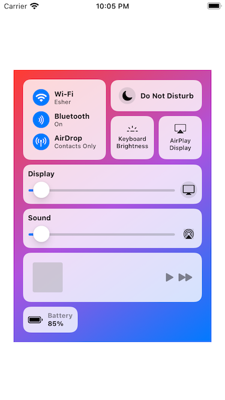
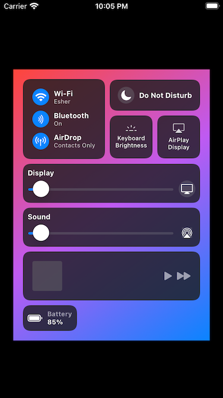

#  Control Center in SwiftUI

An exercise in trying to recreate macOS 11's new Control Center using SwiftUI. Created as an iOS project for no particular reason, could probably be ported to macOS easily enough as well.

This is not even close to pixel perfect and there's a lot of room for improvement. It doesn't use any visual effects to get the right blur and translucency and a lot of the fonts and colours don't match. I didn't bother tackling the sliders either as this was just for fun to learn about laying things out with SwiftUI.

The trickiest part was probably making the AirPlay and keyboard brightness controls have the correct widths, and generally trying to get the tiled controls at the top to have the correct widths and heights. I don't think it's easy to do in a general way that scales to any size, hence the [limit on the total width in ContentView](Sources/ContentView.swift). Also it's kind of obvious that I phoned in the Now Playing control and didn't even bother to see what it looks like when actually playing something. If you want to recreate it down to the fine details then there's still plenty of work left for you.

# Screenshots

Yeah sure but what's it look like?

Light mode:

Dark mode:

# License

Copyright &copy; 2020 Sami Samhuri <sami@samhuri.net>

Licensed under the terms of the [MIT license](https://sjs.mit-license.org).
